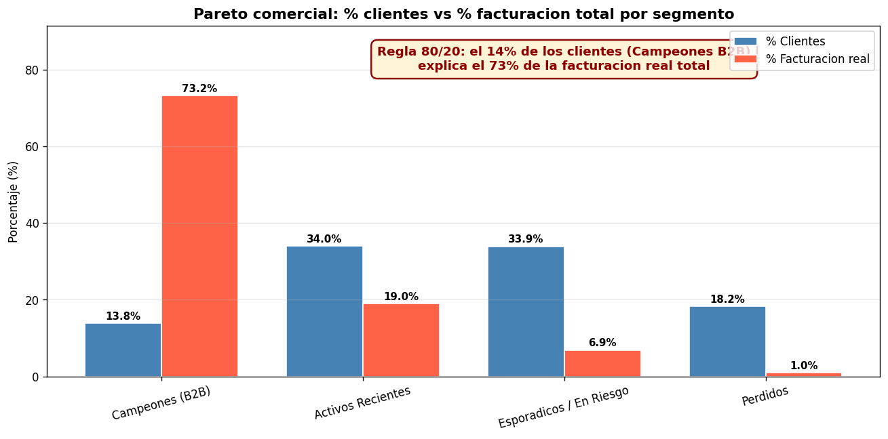

# segmentacion-clientes-ferreteria

<a target="_blank" href="https://cookiecutter-data-science.drivendata.org/">
    
</a>

Proyecto de Aprendizaje Automático **no supervisado** para segmentar clientes de un
e-commerce de ferretería y materiales de construcción (Tierra del Fuego), combinando la
metodología **RFM** (Recency, Frequency, Monetary) con algoritmos de **clustering**.

> ⚠️ **Sobre los datos:** el dataset (`data/raw/transacciones_ecommerce.csv`) es **sintético**, generado con `numpy.random.default_rng(42)` para replicar las dinámicas reales de una empresa del rubro en Tierra del Fuego. No se utilizaron datos reales por motivos de confidencialidad.

## 📊 Resultado principal



Se identificaron **4 segmentos** mediante K-Means sobre features RFM deflactadas. El hallazgo
clave es un Pareto comercial marcado: el **13.8 % de los clientes (Campeones B2B) explica
el 73.1 % de la facturación real**.

| Segmento | n | % Clientes | % Facturación real |
|----------|---|-----------|--------------------|
| 🏆 Campeones (B2B) | 691 | 13.8 % | **73.1 %** |
| 🛒 Activos Recientes | 1.697 | 34.0 % | 19.0 % |
| ⚠️ Esporádicos / En Riesgo | 1.694 | 33.9 % | 6.9 % |
| 💤 Perdidos | 910 | 18.2 % | 1.0 % |

## Datos
- `data/raw/transacciones_ecommerce.csv` — **50.730 transacciones, 5.000 clientes**, período 2024-06 a 2026-05.
- `references/DESCRIPCION_dataset_v2.md` — diccionario de datos (columnas, tipos, origen).
- `references/glosario.md` — glosario de términos (RFM, Silhouette, deflactación, etc.).
- Las variables RFM no vienen en el CSV: se **derivan** agrupando por `id_cliente`.

## 🏃 Quick start

```bash
# 1) Crear y activar un entorno virtual
python -m venv .venv
.venv\Scripts\activate                  # Windows
# source .venv/bin/activate              # Linux/Mac

# 2) Instalar dependencias
pip install -r requirements.txt

# 3a) Reproducir el pipeline completo con Make (recomendado)
make all                                 # ejecuta NB1..NB5 en orden
make report                              # genera el PDF del notebook 4

# 3b) Alternativa: ejecutar manualmente con nbconvert
jupyter nbconvert --to notebook --execute --inplace notebooks/0.0-ig-resumen-ejecutivo.ipynb
jupyter nbconvert --to notebook --execute --inplace notebooks/1.0-ig-eda-y-limpieza.ipynb
# ... y así con cada uno

# 3c) O simplemente abrir en Jupyter para explorarlos
jupyter notebook
```

**Empezar por:** [`notebooks/0.0-ig-resumen-ejecutivo.ipynb`](notebooks/0.0-ig-resumen-ejecutivo.ipynb) — TL;DR del proyecto en 4 celdas.

## 📁 Outputs generados

| Path | Contenido |
|------|-----------|
| `data/interim/transacciones_limpias.parquet` | Dataset limpio (49.909 transacciones tras filtros) |
| `data/processed/clientes_rfm.parquet` | Tabla cliente con RFM + complementarias (4.992 clientes) |
| `data/processed/clientes_segmentados_nombrados.parquet` | + etiqueta cluster + segmento comercial |
| `models/modelo_final_kmeans.joblib` | Modelo K-Means de producción |
| `models/scaler.joblib` | StandardScaler ajustado sobre FEATURES_CLUSTERING |
| `models/deflactor.joblib` | Serie mensual de deflactor por inflación |
| `models/comparativos/{dbscan,jerarquico,gmm}.joblib` | Modelos comparativos |
| `reports/4.0-ig-clustering.pdf` | PDF del notebook principal |
| `reports/figures/*.png` | 20+ figuras generadas (codo, dendrograma, ARI, silhouette, BIC/AIC, Pareto, frontera, etc.) |

Convención de nombres para notebooks (CCDS): `numero-iniciales-descripcion`,
por ejemplo `1.0-ig-eda-y-limpieza.ipynb` (ig = Ian Gallego).

## Project Organization

```
├── LICENSE            <- Open-source license if one is chosen
├── Makefile           <- Makefile with convenience commands like `make data` or `make train`
├── README.md          <- The top-level README for developers using this project.
├── data
│   ├── external       <- Data from third party sources.
│   ├── interim        <- Intermediate data that has been transformed.
│   ├── processed      <- The final, canonical data sets for modeling.
│   └── raw            <- The original, immutable data dump.
│
├── docs               <- A default mkdocs project; see www.mkdocs.org for details
│
├── models             <- Trained and serialized models, model predictions, or model summaries
│
├── notebooks          <- Jupyter notebooks. Naming convention is a number (for ordering),
│                         the creator's initials, and a short `-` delimited description, e.g.
│                         `1.0-jqp-initial-data-exploration`.
│
├── pyproject.toml     <- Project configuration file with package metadata for 
│                         segmentacion and configuration for tools like black
│
├── references         <- Data dictionaries, manuals, and all other explanatory materials.
│
├── reports            <- Generated analysis as HTML, PDF, LaTeX, etc.
│   └── figures        <- Generated graphics and figures to be used in reporting
     └── presentacion_html/ 
     └──  video/ ← 🎬 ACÁ el video
│
├── requirements.txt   <- The requirements file for reproducing the analysis environment, e.g.
│                         generated with `pip freeze > requirements.txt`
│
├── setup.cfg          <- Configuration file for flake8
│
└── segmentacion   <- Source code for use in this project.
    │
    ├── __init__.py             <- Makes segmentacion a Python module
    │
    ├── config.py               <- Store useful variables and configuration
    │
    ├── dataset.py              <- Scripts to download or generate data
    │
    ├── features.py             <- Code to create features for modeling
    │
    ├── modeling                
    │   ├── __init__.py 
    │   ├── predict.py          <- Code to run model inference with trained models          
    │   └── train.py            <- Code to train models
    │
    └── plots.py                <- Code to create visualizations
```

--------

1. Contexto y relevancia del problema
La motivación de este proyecto surge de la intersección entre mi formación previa en el rubro de la construcción como Maestro Mayor de Obra y mis estudios actuales en Ciencia de Datos. El objetivo fue buscar un caso de estudio que conectara ambos mundos, enfocándome en el análisis de un e-commerce de ferretería y materiales de construcción radicado en Tierra del Fuego. Dado que, por cuestiones de confidencialidad, no fue posible utilizar los datos transaccionales directos de la empresa, tomé la decisión de construir un dataset sintético, para no desviarme de mi idea inicial. Este conjunto de datos replica fielmente las lógicas comerciales y el contexto fueguino, sirviendo como base de desarrollo para un modelo reproducible en otros negocios que deseen implementar esta solución con sus propios datos.
A partir de mi experiencia y de conversaciones con el área comercial, identifiqué que la base de clientes en este rubro es altamente heterogénea. Coexisten constructores profesionales, grandes empresas, comercios revendedores y clientes particulares (B2C) que realizan compras puntuales para refacciones hogareñas. Sin embargo, las acciones de marketing actuales (promociones, campañas de mailing, mensajes por WhatsApp) se ejecutan de manera masiva y uniforme. Esta falta de segmentación genera varios problemas:
•	Desperdicio de presupuesto: Se ofrecen descuentos a clientes que tenían intención de compra asegurada.
•	Baja conversión: Los mensajes carecen de relevancia para gran parte de la audiencia, lo que disminuye las tasas de apertura.
•	Fuga de clientes: No existen mecanismos preventivos para detectar clientes valiosos inactivos ni acciones para retenerlos.
•	Subutilización del segmento B2B: No se aprovecha el potencial de los clientes de gran volumen mediante programas de fidelización o trato premium.
La relevancia de este problema se potencia en el contexto de Tierra del Fuego, donde la estacionalidad de la construcción es muy marcada (concentrada en primavera y verano) y la brecha entre el ticket de un cliente B2B y uno B2C es de varios órdenes de magnitud. Una segmentación inteligente permitiría optimizar el presupuesto, mejorar la retención y personalizar la experiencia. Según diversos estudios de marketing digital, la personalización basada en datos puede incrementar las tasas de conversión entre un 10% y un 30%, representando un impacto comercial significativo.
2. Objetivos
Objetivo General
Desarrollar un modelo de aprendizaje automático no supervisado que permita segmentar a los clientes del e-commerce en grupos homogéneos según su comportamiento de compra. Se utilizará la metodología RFM (Recency, Frequency, Monetary) combinada con algoritmos de clustering, con el fin de diseñar y habilitar estrategias de marketing personalizadas y accionables.
Objetivos Específicos
•	Preparación de datos: Construir y acondicionar el dataset histórico mediante limpieza, tratamiento de valores nulos, detección de outliers y normalización.
•	Ingeniería de características: Calcular las variables RFM (R, F, M) para cada cliente e incorporar variables complementarias clave para el rubro (diversidad de categorías, ticket promedio, antigüedad y tipo de cliente inferido B2B/B2C).
•	Análisis Exploratorio (EDA): Analizar la distribución y correlación de las variables para comprender el comportamiento general de la cartera.
•	Evaluación de modelos: Implementar y comparar distintos algoritmos de clustering para determinar la segmentación más coherente y útil. El número óptimo de clusters (K) se definirá mediante el método del codo y el coeficiente de silueta.
•	Interpretación comercial: Perfilar cada segmento obtenido (ej. "Clientes de Alto Consumo", "En riesgo", "Ocasionales") y proponer estrategias de marketing diferenciadas, estimando su impacto potencial.
3. Tipo de problema
El presente trabajo aborda un problema de aprendizaje no supervisado, específicamente de agrupamiento o clustering. Al no contar con una variable objetivo preestablecida (etiquetas) que indique a qué segmento pertenece cada cliente, el modelo tendrá la tarea de descubrir la estructura subyacente en los datos y agrupar a los usuarios basándose en la similitud de sus hábitos de compra.
Como posible trabajo futuro o extensión del proyecto, una vez validados los clusters, estos podrían utilizarse como etiquetas sintéticas para entrenar un modelo de aprendizaje supervisado (como Random Forest o XGBoost). Esto permitiría clasificar automáticamente a los nuevos clientes a medida que ingresan al sistema, operativizando la segmentación en tiempo real.
4. Modelos a utilizar
Para garantizar la robustez del análisis, se evaluarán y compararán los siguientes algoritmos:
•	K-Means: Se utilizará como modelo base debido a su simplicidad, eficiencia computacional y amplio uso en la literatura para segmentaciones RFM. El hiperparámetro K se optimizará mediante el método del codo y el coeficiente de silueta.
•	Clustering Jerárquico Aglomerativo: Permitirá visualizar la estructura topológica de los grupos mediante un dendrograma, sirviendo como validación cruzada para los resultados de K-Means sin necesidad de definir K a priori.
•	DBSCAN: Al estar basado en densidad, es altamente robusto frente a valores atípicos y permite geometrías de clusters arbitrarias. Es fundamental para este dominio, ya que las compras mayoristas de clientes B2B representan outliers legítimos en el monto transaccional y no simples errores de carga.
•	Gaussian Mixture Models (GMM): Evalúa asignaciones probabilísticas (soft clustering), aportando una visión más realista para aquellos clientes cuyos comportamientos se encuentran en la frontera entre dos segmentos. A diferencia de K-Means (asignación hard), GMM asigna probabilidades de pertenencia a cada cluster y soporta `.predict()` para clientes nuevos.
Métricas y técnicas complementarias:
La evaluación cuantitativa se realizará utilizando el coeficiente de silueta, el índice de Davies-Bouldin y el índice de Calinski-Harabasz. No obstante, la validación cualitativa (la interpretabilidad comercial de los clusters) será el criterio definitivo de éxito. Además, se aplicará estandarización de variables (StandardScaler) previo al modelado por distancias, y técnicas de reducción de dimensionalidad (PCA o t-SNE) para la visualización en 2D.
5. Metodología propuesta
El desarrollo del proyecto seguirá un pipeline estructurado en las siguientes fases:
1.	Extracción y consolidación de la base transaccional.
2.	Limpieza de datos (tratamiento de nulos, devoluciones, registros duplicados).
3.	Ingeniería de variables (Cálculo de features RFM y métricas complementarias).
4.	Análisis Exploratorio de Datos (EDA) y visualización.
5.	Estandarización de escalas.
6.	Entrenamiento de algoritmos y búsqueda de hiperparámetros.
7.	Evaluación mediante métricas internas y validación de negocio.
8.	Perfilado de segmentos y propuesta de acciones de retención/conversión.
9.	Documentación técnica y presentación final.

6. Origen y Recopilación del Dataset
El presente conjunto de datos, denominado transacciones_ecommerce.csv, surge como un caso de estudio integrador cuyo objetivo es analizar el comportamiento transaccional de un e-commerce del rubro ferretero y de materiales de construcción. El mismo está focalizado en la matriz comercial de Tierra del Fuego, tomando como principal referente y caso real de una empresa radicada en la ciudad de Río Grande.
Por motivos de estricta confidencialidad corporativa y protección de datos sensibles, no fue posible extraer ni manipular la base de datos de producción directa de la compañía. Para no desvirtuar el propósito metodológico de la investigación, se procedió a la generación de un dataset sintético. Este proceso de recopilación y creación se realizó mediante un script en Python (generar_dataset.py) utilizando una semilla aleatoria (numpy.random.default_rng(42)) 
Los datos generados no son meramente aleatorios, sino que replican fielmente las lógicas y dinámicas observables en la provincia entre el 7 de junio de 2024 y el 31 de mayo de 2026. Esto incluye la inyección del modelado de inflación en pesos argentinos, la marcada estacionalidad de la construcción austral (con picos marcados de diciembre a marzo y pozos profundos de junio a agosto), y los patrones de concentración de facturación en segmentos B2B (constructoras y contratistas) siguiendo una distribución de Pareto.
6.2. Descripción Estructural del Conjunto de Datos
El dataset presenta un formato tabular estándar y está compuesto por las siguientes dimensiones principales:
•	Cantidad de Instancias (Filas): 50.730 transacciones. (Nota metodológica: se conservaron intencionalmente 75 duplicados exactos para poder efectuar evaluaciones en la fase de limpieza).
•	Cantidad de Clientes: 5.000 clientes únicos. 
•	Características (Columnas): 9 variables de negocio.
El diccionario de datos :
1.	id_transaccion (String): Código único alfanumérico para cada venta (formato TX-XXXXXX). Contiene huecos deliberados en la numeración simulando operaciones no concretadas.
2.	id_cliente (String): Código identificador único del cliente (formato CLI-XXXXX).
3.	fecha (Date): Fecha de registro de la transacción en formato estándar YYYY-MM-DD.
4.	categoria_producto (String): Variable categórica nominal que agrupa la compra en 12 rubros ferreteros distintos. Presenta un desbalanceo realista.
5.	cantidad_items (Integer): Variable numérica discreta indicando las unidades adquiridas por compra (rango de 1 a 300).
6.	monto_total (Float): Variable numérica continua que refleja el importe final en ARS. Contempla valores negativos para representar notas de crédito y devoluciones.
7.	canal_venta (String): Variable categórica del entorno por el que ingresó la transacción (Web, App, Telefónico).
8.	medio_pago (String): Variable categórica con 5 métodos de pago oficiales. Presenta variantes de texto o abreviaturas introducidas a modo de ruido.
9.	localidad (String): Variable categórica geográfica (Río Grande, Ushuaia, Tolhuin). Contiene variaciones intencionales de mayúsculas, espacios y errores tipográficos.
7. Calidad de los Datos y Preprocesamiento Requerido
Fiel a un entorno empresarial crudo, este conjunto incorpora diversas imperfecciones de forma correlacionada. Para su correcta ingesta en futuros algoritmos, será necesario programar un pipeline de preprocesamiento estructurado (implementando librerías especializadas como Pandas) enfocado en las siguientes tareas:
•	Tratamiento de Valores Nulos: Se identificaron 84 nulos en monto_total (~0,8 %, concentrados en el canal telefónico — falla de pasarela que requiere dropeo). Asimismo, 119 nulos en medio_pago (~1,2 %), 34 en localidad (~0,3 %) y 32 en categoria_producto (~0,3 %), imputados con el valor canónico "Desconocido".
•	Gestión de Outliers y Anomalías: Existen cerca de 60 compras masivas de características atípicas (llegando a valores de ~$33 M) pertenecientes a obras grandes, las cuales requieren winsorización o documentación específica. Simultáneamente, se identificaron 90 registros con montos negativos (devoluciones) que se deben netear o filtrar en función del análisis RFM (Recency, Frequency, Monetary value).
•	Normalización de Textos (Strings): Ciertas variables categóricas exigen limpieza de texto. El campo localidad requiere la aplicación de .str.strip().str.title() para solventar espacios residuales y faltas ortográficas (como "Tohluin"), mientras que medio_pago necesita ser mapeado a su forma canónica para corregir entradas como "transf.", "T. crédito", etc.
•	Eliminación de Duplicados: Ejecución de funciones de limpieza para purgar los 15 registros idénticos detectados.
8. Resultado esperado
Al finalizar el proyecto, se entregará:
•	Un dataset curado y documentado con las características RFM de los clientes.
•	Un modelo de clustering entrenado, validado y con sus decisiones paramétricas justificadas.
•	Un diccionario de perfiles comerciales detallando el comportamiento de cada segmento.
•	Un plan de acción con recomendaciones de marketing orientadas a datos.
•	El código fuente completo y reproducible en Python (utilizando librerías como pandas, scikit-learn, matplotlib y seaborn), alojado en un repositorio o notebook estructurado.
Este entregable no solo cumplirá con los requisitos académicos de la materia, sino que sentará las bases lógicas y metodológicas para que una empresa del sector pueda implementar estrategias de personalización reales y medibles.


